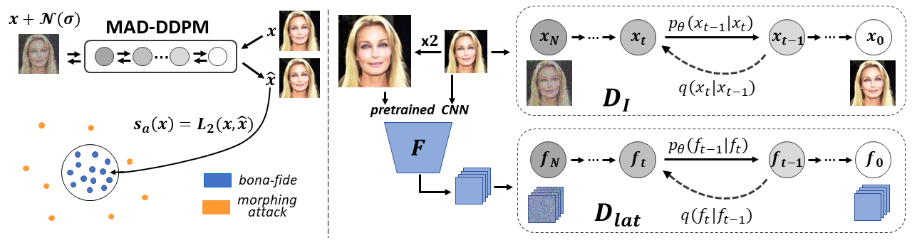

# MAD-DDPM
An official implementation of the paper "Face Morphing Attack Detection with Denoising Diffusion Probabilistic Models" [^1]. 

MAD-DDPM is a one-class learning model that uses a reconstruction-based measure to determine whether the input images are bona fide or face morphs. At the core of the technique is a two-branch reconstruction procedure that uses denoising diffusion probabilistic models (DDPMs) learned over only bona-fide samples as the basis for the
detection tasks. The first branch models the distribution on bona-fide samples directly in the pixel-space (for low-level artifact detection), while the second captures the distribution of higher-level features extracted with a pretreind CNN.
      



For more information please refer to the paper available [here]().

## 1. Install the dependencis
The model is implemented using PyTorch. The full list of used libraries can be found in requirements.txt.
```
pip install -r requirements.txt
```

## 2. Prepare the data
The dataset you are using for training should have the following directory structure where the names of individual classes are represented with unique nubers or strings:
```
Dataset_name
├── id_1
│   └── id_1_img_0.png
│   └── id_1_img_1.png
|   ...
├── id_2
│   └── id_2_img_0.png
│   └── id_2_img_1.png
|   ...
...
```

## 3. Training
To train MAD-DDPM on Dataset_name, run the following:
```
python train.py 
```
## 4. Evaluation
To test a pretrined MAD-DDPM model run the following:
```
python test.py 
```
## 5. Citing MAD-DDPM
If you find this code useful or you want to refer to the paper, please cite using the following BibTeX:
```
@INPROCEEDINGS{ivanovska2023mad_ddpm,
  author={Ivanovska, Marija and Štruc, Vitomir},
  booktitle={2023 International Workshop on Biometrics and Forensics (IWBF)}, 
  title={Face Morphing Attack Detection with Denoising Diffusion Probabilistic Models}, 
  year={2023}}
```

## Acknowledgements
This code is largely based on [k-diffusion](https://github.com/crowsonkb/k-diffusion).

  
## References
[^1]: M. Ivanovska, V. Struc, Face Morphing Attack Detection with Denoising Diffusion Probabilistic Models, International Workshop on Biometrics and Forensics (IWBF), 2023
